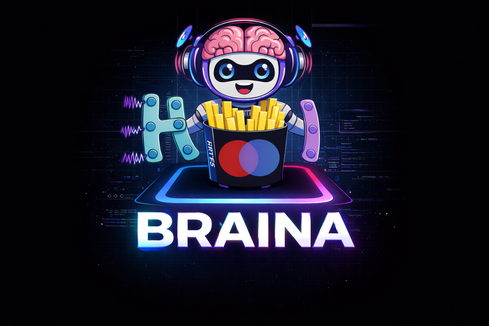

<p align="center">
  
</p>

# Braina: AI agent for Brain Interaction Analysis

Braina is a framework that turns AI coding agents into experts in Brain Interaction Analysis from high-dimensional brain data. It provides curated examples, tutorials, research papers and a Model Contect Protocol (MCP) server. Braina can provide and test codes to analyze complex neural interactions using information-theoretical measures and two Python packages developed by the [BraiNets](https://github.com/brainets) team at the [Institut de Neurosciences de la Timone](https://www.int.univ-amu.fr/) (Frites and HOI). Braina works with different AI agents Command Line Interface (CLI) platforms, such as Claude Code, Gemini CLI, OpenAI Codex CLI and OpenCode. 

## Core Toolboxes

Braina integrates three Python libraries for brain interaction analysis:

- **[Frites](https://github.com/brainets/frites)** — Single-trial functional connectivity and information-theoretical analysis (Granger causality, transfer entropy, PID, DFC, mutual information workflows).
- **[HOI](https://github.com/brainets/hoi)** — Higher-Order Interactions using JAX (O-information, synergy, redundancy, RSI, DTC, InfoTopo).

These tools operate on electrophysiological data: fMRI, MEG, EEG, LFP, and MUA multivariate time series.

## Installation

### Prerequisites

- **Python 3.10+**
- **[uv](https://docs.astral.sh/uv/)** — used for dependency management. All scripts use PEP 723 inline metadata, so no virtualenv setup is needed.
- **Node.js** (for installing CLI agents via npm)

Install uv if you don't have it:

```bash
curl -LsSf https://astral.sh/uv/install.sh | sh
```

### Clone the repository

```bash
git clone https://github.com/brainets/braina.git
cd braina
```

### Verify the environment

```bash
uv run check_env.py        # Check core dependencies (frites, hoi, xgi, numpy, xarray, mne, jax)
uv run mcp/verify_libs.py  # Run the test suite for Frites + HOI functions
```

## Setting up an AI Agent

Braina includes **project-level configuration files** for all four supported AI coding agents. After cloning, simply install your preferred CLI and launch it from the `braina/` directory.

### Option A: Claude Code

```bash
# Install
npm install -g @anthropic-ai/claude-code

# Register the MCP server (one-time setup)
claude mcp add braina -- uv run mcp/braina_mcp.py

# Launch (from braina directory)
claude
```

Reads `CLAUDE.md` for project context.

### Option B: Gemini CLI

```bash
# Install
npm install -g @google/gemini-cli

# Launch (from braina directory) — MCP config is in .gemini/settings.json
gemini
```

Reads `GEMINI.md` for project context. The project includes `.gemini/settings.json` with the braina MCP server pre-configured.

### Option C: OpenAI Codex CLI

```bash
# Install
npm install -g @openai/codex

# Launch (from braina directory) — MCP config is in .codex/config.toml
codex
```

Reads `AGENTS.md` for project context. The project includes `.codex/config.toml` with the braina MCP server pre-configured.

### Option D: OpenCode

```bash
# Install
curl -fsSL https://opencode.ai/install | bash
# Or: npm install -g opencode-ai

# Launch (from braina directory) — MCP config is in opencode.json
opencode
```

Reads `AGENTS.md` for project context. The project includes `opencode.json` with the braina MCP server pre-configured.

### Adding optional MCP servers (Gemini CLI)

For Gemini CLI, you can add additional MCP servers (GitHub, Context7) to your global config at `~/.gemini/settings.json`. See [gemini-cli-setup.md](gemini-cli-setup.md) for details.

## Project Structure

```
braina/
├── mcp/
│   ├── braina_mcp.py      # MCP server — 30+ tools wrapping Frites & HOI
│   ├── verify_libs.py     # Test suite for all wrapped functions
│   └── __init__.py
├── examples/
│   ├── frites/            # ~30 example scripts
│   │   ├── conn/          # Connectivity metrics (covgc, dfc, spec, ccf, ...)
│   │   ├── mi/            # Mutual information analysis
│   │   ├── simulations/   # AR model data simulation
│   │   ├── statistics/    # Statistical testing
│   │   └── ...
│   └── hoi/               # ~20 example scripts
│       ├── metrics/       # O-info, synergy, redundancy, RSI, DTC
│       ├── it/            # Information theory fundamentals
│       └── ...
├── tutorials/
│   ├── multivariate_information_theory_frites_hoi_xgi/
│   └── seeg_ebrains_frites/
├── usecases/              # Real-world analysis scenarios
│   ├── brainhack_26/      # BrainHack 2026 challenges
│   ├── hoi/               # HOI redundancy/synergy detection
│   ├── granger/           # Granger Causality analysis
│   └── master_td/         # Master's travaux dirigée
├── papers/                # Research papers (theoretical foundation)
│
│ # Agent instruction files
├── CLAUDE.md              # Project context for Claude Code
├── GEMINI.md              # Project context for Gemini CLI
├── AGENTS.md              # Project context for Codex CLI & OpenCode
│
│ # Agent MCP configurations (project-level)
├── opencode.json          # OpenCode MCP config
├── .codex/
│   └── config.toml        # Codex CLI MCP config
├── .gemini/
│   └── settings.json      # Gemini CLI MCP config
├── .claude/
│   └── settings.local.json  # Claude Code permissions
│
├── check_env.py           # Environment verification
└── gemini-cli-setup.md    # Detailed MCP server setup guide
```

### MCP Server (`mcp/braina_mcp.py`)

The central component. A [FastMCP](https://github.com/modelcontextprotocol/python-sdk) server that exposes 30+ tools over the standard MCP stdio transport. Each tool wraps a Frites or HOI function with file-based I/O (`.npy` or `.nc` files). Tool categories:

| Category | Tools |
|---|---|
| Data I/O | `inspect_data`, `read_pdf` |
| Frites connectivity | `frites_conn_covgc`, `frites_conn_dfc`, `frites_conn_pid`, `frites_conn_ii`, `frites_conn_te`, `frites_conn_fit`, `frites_conn_spec`, `frites_conn_ccf` |
| Frites workflows | `frites_wf_mi`, `frites_wf_stats`, `frites_wf_conn_comod` |
| Frites simulation | `frites_sim_ar` |
| HOI metrics | `hoi_oinfo`, `hoi_gradient_oinfo`, `hoi_infotopo`, `hoi_redundancy_mmi`, `hoi_synergy_mmi`, `hoi_rsi`, `hoi_dtc`, `hoi_get_nbest_mult` |

### Examples

~50 self-contained Python scripts demonstrating Frites and HOI usage. Each script uses PEP 723 inline dependencies and can be run with `uv run`:

```bash
uv run examples/frites/conn/ex_conn_covgc.py
uv run examples/hoi/metrics/ex_oinfo.py
```

### Tutorials

- **`multivariate_information_theory_frites_hoi_xgi/`** — Integration of frites, hoi, and xgi for multivariate information theory analysis. Based on Giovanni Petri's [practical tutorial](https://github.com/lordgrilo/cnww-hoi).
- **`seeg_ebrains_frites/`** — Analyzing SEEG data with frites. Dataset: Lachaux, J.-P., Rheims, S., Chatard, B., Dupin, M., & Bertrand, O. (2023). Human Intracranial Database (release-5). EBRAINS. https://doi.org/10.25493/FCPJ-NZ

### Use Cases

Real-world analysis prompts and solutions that demonstrate end-to-end workflows: AR model simulation, dynamic functional connectivity, higher-order interaction detection, and Granger causality analysis.

## License

BSD 3-Clause License. See [LICENSE](LICENSE).
